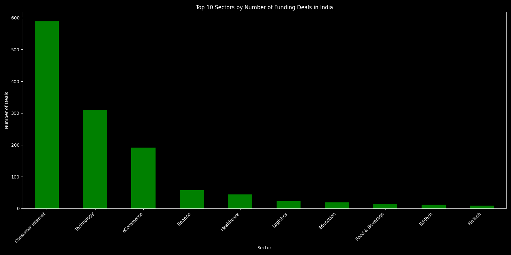
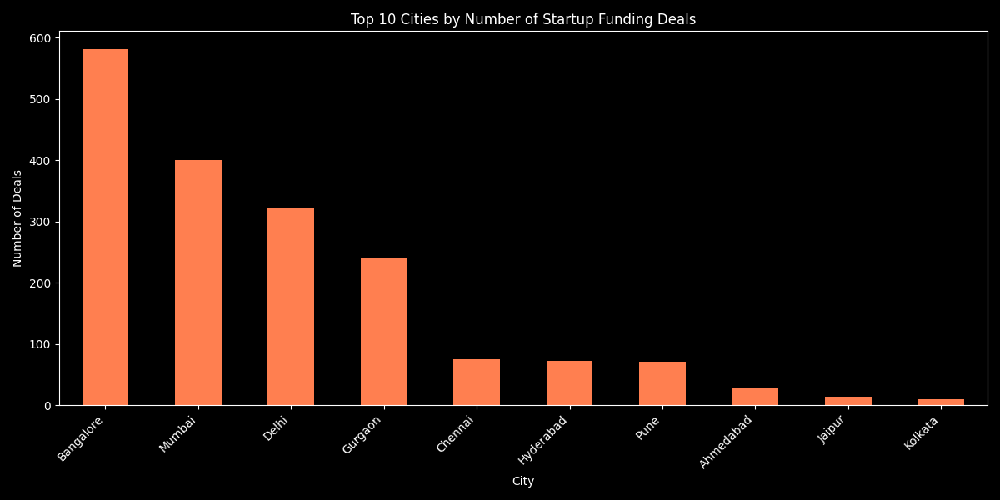
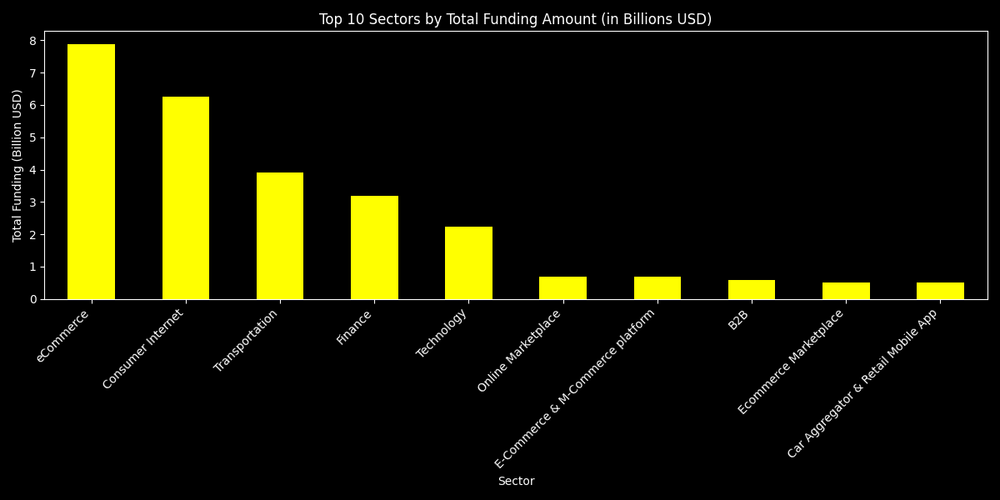

# Indian Startup Funding Analysis 🇮🇳

A complete exploratory data analysis of 3000+ Indian startup funding deals using Python, Pandas and NumPy. Built as a first data science project to uncover patterns in how Indian startups raise money, which sectors attract investors, and which cities dominate the startup ecosystem.

---

## Questions I Set Out to Answer
- Which sector received the most funding deals?
- Which sector received the most money?
- Which city dominates the Indian startup scene?
- What does a typical funding deal look like?
- Is the average deal size an accurate representation of reality?

---

## Key Findings
- **Consumer Internet** dominated with **589 deals** — the most active sector by number of investments
- **eCommerce** received the most money — **$7.89 Billion** in total funding
- **Bangalore** is India's undisputed startup capital with **582 deals**
- The **typical deal size is $1.70 Million** (median) — much lower than the average of $18.43 Million
- The **largest single deal was $3.90 Billion** — a massive outlier that skews the average significantly
- **Finance + FinTech combined** received **$3.20 Billion** — making it the 4th biggest sector

---

## Charts

### Top 10 Sectors by Number of Deals

### Top 10 Cities by Number of Deals

### Top 10 Sectors by Total Funding Amount

---

## My Thinking Process — How I Derived These Results

### Step 1 — Loading and understanding the data
The first thing I did was load the dataset and just look at it. I checked the shape, column names, data types and missing values before touching anything. This gave me a clear picture of what I was working with — 3044 rows, 10 columns, and a lot of missing values especially in the Amount column (960 missing).

**Lesson learned:** Never start analysis without first understanding your data completely.

---

### Step 2 — Deciding what to keep
The dataset had columns like `Sr No`, `SubVertical` and `Remarks` that weren't useful for my questions. I kept only the 5 columns I needed — Startup Name, Industry Vertical, City, Investors Name and Amount in USD. This made the data easier to work with and think about.

**Lesson learned:** Less is more. Only keep what you need.

---

### Step 3 — Fixing the Amount column
This was the trickiest part. The Amount column looked like numbers but Python was treating it as text because of commas — for example `"20,00,00,000"` instead of `200000000`. I had to strip the commas and convert to numeric. Some values couldn't be converted and became NaN — I dropped those rows. This brought the dataset from 3044 to 2065 clean rows.

**Lesson learned:** Always check the data type of numeric columns. Numbers stored as text will silently break all your calculations.

---

### Step 4 — Spotting and fixing inconsistent names
When I counted deals by sector I noticed `eCommerce`, `ECommerce` and `E-Commerce` were all the same sector written differently by different people who entered the data. Same with cities — `Bangalore` and `Bengaluru` are the same city, as are `Gurgaon` and `Gurugram`. After merging these duplicates the eCommerce count jumped from 126 to 191 and Bangalore jumped from 456 to 582. I also merged `FinTech` into `Finance` which pushed Finance's total funding from $1.97B to $3.20B — a completely different picture.

**Lesson learned:** Dirty data gives wrong answers. Always check for duplicates hiding as different spellings before drawing conclusions.

---

### Step 5 — Counting deals vs measuring money
My first instinct was to rank sectors by number of deals. Consumer Internet came first with 589 deals. But then I asked a different question — which sector received the most actual money? The answer was completely different. eCommerce led with $7.89B while Transportation appeared in the top 3 despite having fewer deals. This showed me that deal count and deal value tell completely different stories.

**Lesson learned:** Always ask the same question in multiple ways. "Most popular" and "most valuable" are not the same thing.

---

### Step 6 — Understanding average vs median
NumPy gave me an average deal size of $18.43 Million but a median of only $1.70 Million. That huge gap told me something important — a few massive deals like the $3.90 Billion outlier were pulling the average way up. The median of $1.70 Million is the true picture of what a typical Indian startup raises. This is why financial reports always use median salary instead of average salary.

**Lesson learned:** When data has outliers, median is more honest than average. Always calculate both and compare them.

---

## Tools Used
- **Python** — core programming language
- **Pandas** — data loading, cleaning, grouping and analysis
- **NumPy** — statistical calculations (mean, median, max, min)
- **Matplotlib** — data visualization and chart generation

---

## Dataset
- **Source:** Kaggle — Indian Startup Funding
- **Original size:** 3044 records
- **After cleaning:** 2065 records
- **Columns used:** Startup Name, Industry Vertical, City Location, Investors Name, Amount in USD
